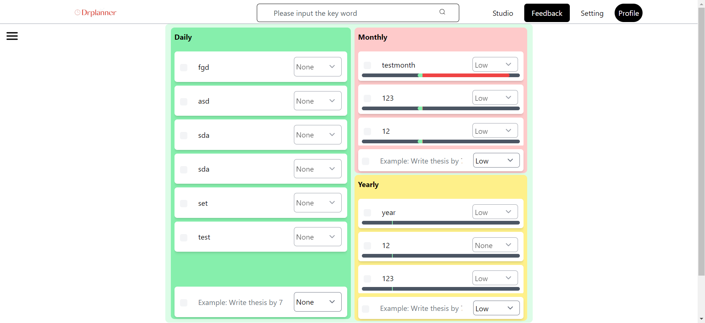
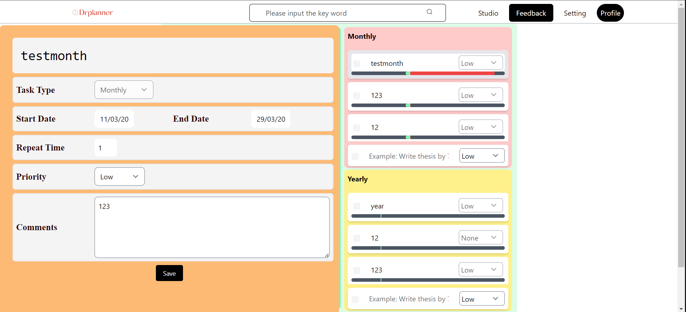

# DRPlanner
> A lightweight offline(temporarily) todo list
> Display the daily, monthly, yearly plan in one page
>Use praogress bar to demonstrate your plan progress 

## Technique stack:
### Backend:
- Node.js
- Express
- MongoDB
- JWT

### Frontend:
- TypeScript
- Sanity
- Tailwind
- React
- Next.js
- Redux

### Deployment:
AWS: amplify, EC2

## Preview

## To Do List
- [ ] User access control(Sanity)
- [x] Complish function of monthly/yearly task
- [x] Visualize progress
- [ ] report page
- [ ] sticky note
- [ ] ... 

